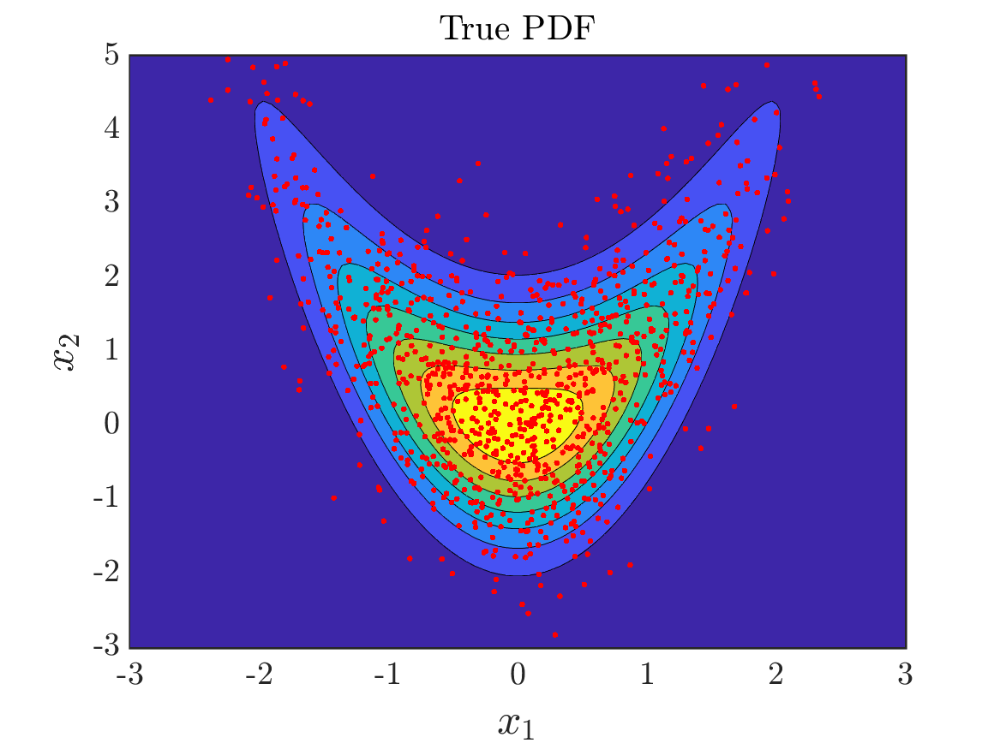
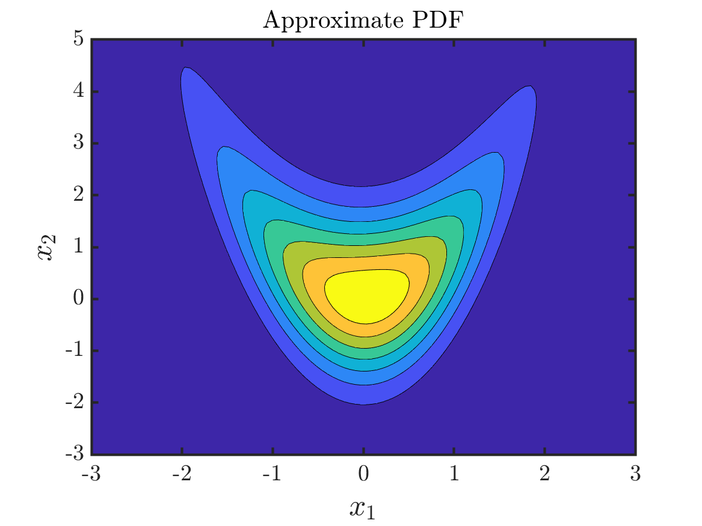

# AdaptiveTransportMaps: ATM 

## What is the ATM algorithm?

Package contains methods and algorithms for learning monotone triangular transport maps given access to samples from a target density or evaluations of the target. The Adaptive Transport Map algorithm is a greedy approach for learning parameteric map approximation using a sparse feature expansion.

More information on the methodology for this sofware can be found in this [preprint](https://arxiv.org/pdf/2009.10303.pdf). The authors are Ricardo Baptista (MIT), Youssef Marzouk (MIT), and Olivier Zahm (INRIA). The software is currently being maintained by the [Uncertainty Quantification Group](https://uqgroup.mit.edu) at MIT.

## Software development team

Ricardo Baptista (MIT), Paul-Baptiste Rubio (MIT)

E-mails: <rsb@mit.edu>, <rubiop@mit.edu>

## Installation

The ATM algorithm is implemented in MATLAB and does not require additional packages.
Check installation by typing `runtests` in MATLAB from inside the testing folder.

## Example

Let the target density be the product of two conditional Gaussians . Our goal is to approximate the density given 1000 i.i.d. samples in .

First, we standardize the samples with a linear transport map as
```
    G = GaussianPullbackDensity(2, true);
    G = G.optimize(X);
    Xnorm = G.evaluate(X);
```

Next, we define the pullback density of a monotone triangular map represented using expansions of Hermite polynomials through a two-dimensional standard Gaussian density as
```
    ref = IndependentProductDitribution({Normal(), Normal()});
    basis = HermiteProbabilistPolyWithLinearization();
    S = identity_map(1:2, basis);
    PB = PullbackDensity(S, ref);
```

To optimize the map we use a greedy algorithm that enriches the basis functions in the map starting from an identity function. We run this procedure for 5 iterations for each component. In practice, we recommend using a cross-validation procedure to select the optimal number of terms in each expansion.
```
    [PB, ~] = PB.greedy_optimize(Xnorm, [], [5,5], 'max_terms');
```

The final map `CM` is given by the composition of `G` and `PB` as
```
    CM = ComposedPullbackDensity({G, PB}, ref);
```

To plot the approximate density, we evaluate `CM.log_pdf` on a grid of points. The true and approximate densities are given below.

|  | |
| ----------- | ----------- |
|  |  |

We can also generate 100 samples from the approximate density by inverting the map at samples from the standard Gaussian reference using
```
    Xsamples = G.S.inverse(PB.S.inverse(randn(100,2)));
```

We can evaluate the approximate conditional density  using the second component of the map. We can evaluate the pullback density of the Gaussian reference through the second component at `x` as `CM.log_pdf(x,2)`. 
